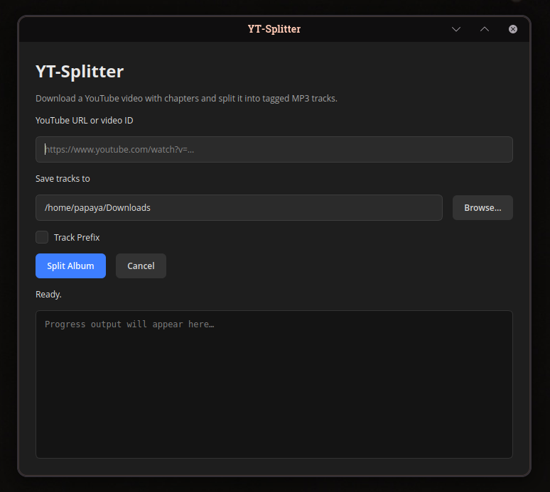

# YT-Splitter (MP3)


Downloads and splits audio tracks from a YouTube video according to the chapters/tracks.
Useful for compilations or full album uploads.

## GUI (new)



A PyQt6 desktop GUI is included for users who prefer a graphical workflow.

- Paste a YouTube URL or video ID
- Choose an output folder
- Optional **Track Prefix** checkbox for `01 - Track Name.mp3` filenames
- Live progress log while downloading and splitting

Tracks are exported in chapter order. ID3 tags include track number and album metadata.

## Requirements

- **ffmpeg** installed and in your `PATH`
- **Python 3.8+** (for the GUI / Python splitter)
- **yt-dlp** (recommended; used instead of legacy `youtube-dl`)

## Quick install (GUI + `ytsplit` command)

```bash
git clone https://github.com/redsolver/yt-splitter.git
cd yt-splitter
./install.sh
```

This creates a virtual environment, installs dependencies, and registers the `ytsplit` terminal command.

Then:

```bash
ytsplit                         # open GUI
ytsplit <youtube-url> [folder]  # split from terminal
ytsplit <url> [folder] --track-prefix
```

## Original CLI install (Dart binary)

1. Download the binary for your system from https://github.com/redsolver/yt-splitter/releases
2. Rename it to `yt-splitter`
3. Place it in a directory which is in your `PATH`
4. Make it executable (`chmod +x yt-splitter` on Linux)

## Usage

### Python splitter / GUI

1. Choose where you want tracks saved (GUI folder picker, or pass a directory on the CLI).
2. Run `ytsplit` or `python splitter.py <url> [directory]`.
3. Tracks are saved into a subfolder named after the video title.

Optional track prefixes:

- Off: `Song Name.mp3`
- On: `01 - Song Name.mp3`, `02 - Next Track.mp3`, etc.

### Original Dart CLI

1. `cd` into the directory you want to save the tracks in. `yt-splitter` will automatically create a subdirectory with the title of the video and store the downloaded tracks in it.
2. Execute `yt-splitter VIDEOID` (`VIDEOID` can be a YouTube video id or a URL to a YouTube video)

## Notes

- The video must have YouTube chapters (common on full-album uploads).
- The Python path uses **yt-dlp** via a small `bin/youtube-dl` wrapper for compatibility with the original tool.
- The original Dart CLI still works alongside the new Python GUI/splitter.
